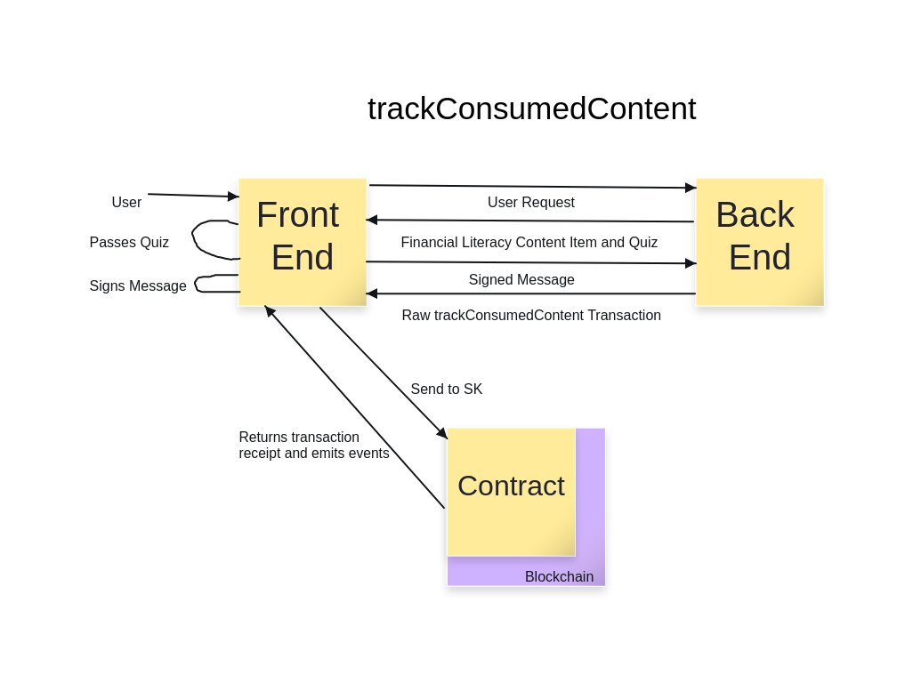

# Daily Financial Literacy Dapp

Financial Literacy Facilitator is a decentralized app to help motivate people to improve their knowledge of financial literacy through an incentivized revenue sharing system. Users earn points by clicking on approved links to read external content or submitting additional content on financial literacy, which will then be used to share in ad revenue generate by the site.

## Roadmap

1. Version 1

2. Version 2: Consuming Content

3. Version 3: Proposing Content

4. Version 4: Earning Points When Consuming Content

5. Version 5: Distributing Awards Based on Point

6. Version 6: Distributing Awards to Non-Participants

7. Version 7: Introduce Epochs

8. Version 8: Disincentivizing Inappropriate Content

9. Version 9: Incentivizing Appropriate Content

## Diagrams




## Requirements

Before you begin, you need to install the following tools:

- [Node (v18 LTS)](https://nodejs.org/en/download/)
- Yarn ([v1](https://classic.yarnpkg.com/en/docs/install/) or [v2+](https://yarnpkg.com/getting-started/install))
- [Git](https://git-scm.com/downloads)

## Quickstart

To get started with Scaffold-ETH 2, follow the steps below:

1. Clone this repo & install dependencies

```
git clone https://github.com/scaffold-eth/scaffold-eth-2.git
cd scaffold-eth-2
yarn install
```

2. Run a local network in the first terminal:

```
yarn chain
```

This command starts a local Ethereum network using Hardhat. The network runs on your local machine and can be used for testing and development. You can customize the network configuration in `hardhat.config.ts`.

3. On a second terminal, deploy the test contract:

```
yarn deploy
```

This command deploys a test smart contract to the local network. The contract is located in `packages/hardhat/contracts` and can be modified to suit your needs. The `yarn deploy` command uses the deploy script located in `packages/hardhat/deploy` to deploy the contract to the network. You can also customize the deploy script.

4. On a third terminal, start your NextJS app:

```
yarn start
```

Visit your app on: `http://localhost:3000`. You can interact with your smart contract using the `Debug Contracts` page. You can tweak the app config in `packages/nextjs/scaffold.config.ts`.

Run smart contract test with `yarn hardhat:test`

- Edit your smart contract `YourContract.sol` in `packages/hardhat/contracts`
- Edit your frontend in `packages/nextjs/pages`
- Edit your deployment scripts in `packages/hardhat/deploy`

## Documentation

Visit our [docs](https://docs.scaffoldeth.io) to learn how to start building with Scaffold-ETH 2.

To know more about its features, check out our [website](https://scaffoldeth.io).
